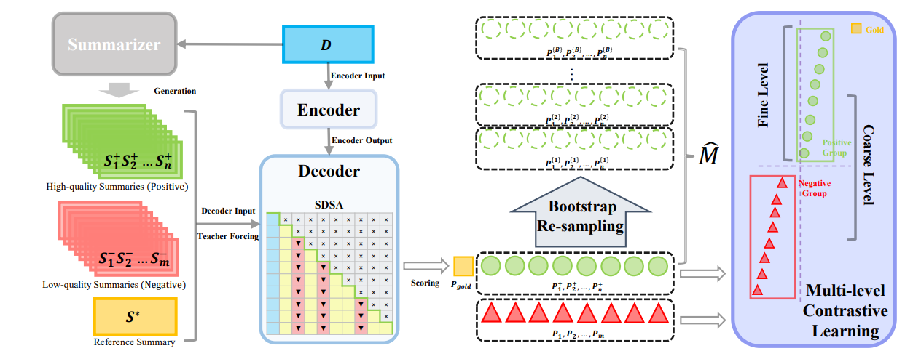

# SimMCS
This repository contains the code for our paper [Alleviating Exposure Bias via Multi-level Contrastive Learning and Deviation Simulation in Abstractive Summarization](https://aclanthology.org/2023.findings-acl.617/).
## Overview
In this paper, we present a simple yet effective framework to alleviate _exposure bias_ from two different perspectives in abstractive summarization.

## Installation
- `python3.10`
- `conda create --name env --file spec-file.txt`
- `conda activate env`
- `pip install -r requirements.txt`
- `git clone https://github.com/neulab/compare-mt.git`
- `cd ./compare-mt`
- `pip install -r requirements.txt`
- `python setup.py install`

## Training
For CNNDM dataset, we run the code below:
```console
python ./src/main.py --cuda --gpuid 1 --config cnndm -l
```
